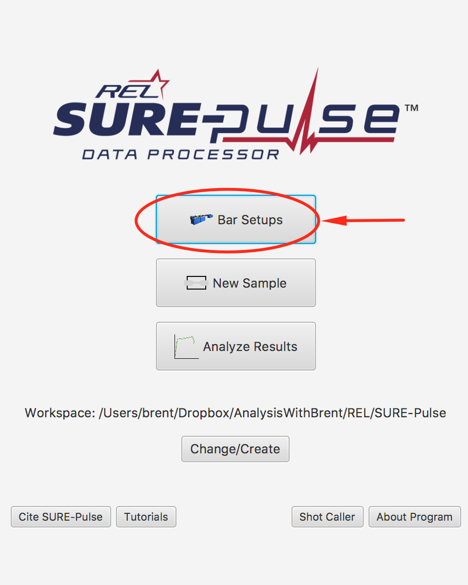
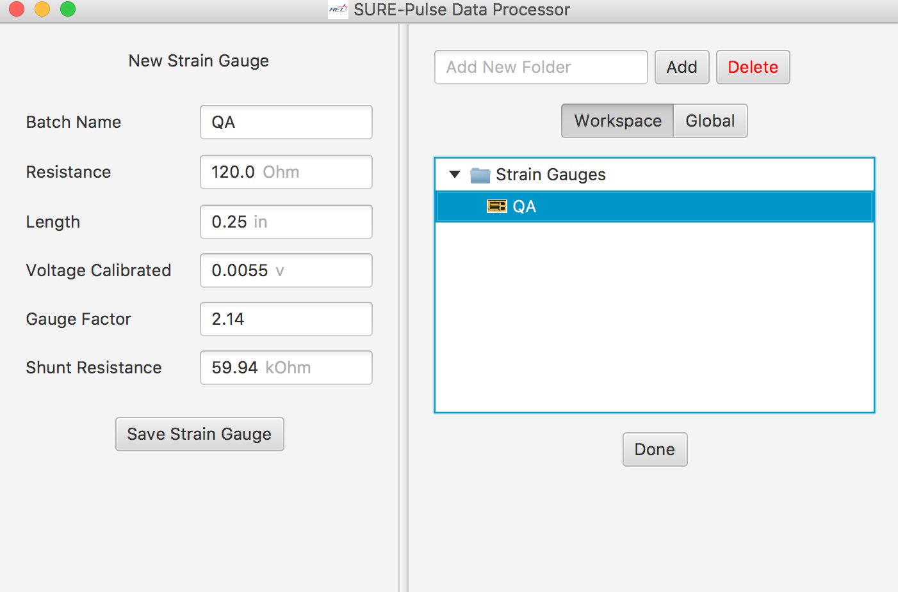
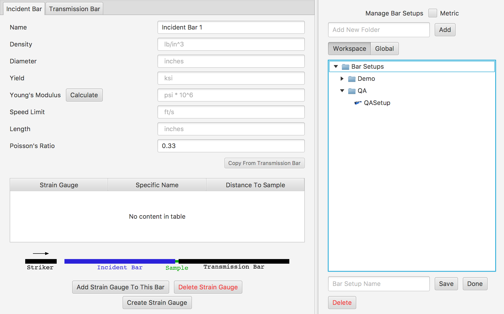

# SURE-Pulse Bar Setup and Strain Gauge
Enter these bars and the strain gauge into the SurePulse interface.

## Compression bar setup
Strain Gauge: (Used by both bars)
Resistance: 120.0 Ohm
Length: 0.25
Voltage Calibrated: 0.0055 V
Gauge Factor: 2.14
Shunt Resistance: 59.94 kOhm

Incident Bar:
Density: 0.298 lb/in^3
Diameter: 0.5 inches
Yield: 300.0 ksi
Young’s Modulus: 29.3165 psi * 10^6
Speed Limit: (calculated)
Length: 72.0 inches
Strain Gauge: 36 inches to sample

Transmission Bar:
Density: 0.298 lb/in^3
Diameter: 0.5 inches
Yield: 300.0 ksi
Young’s Modulus: 29.3225 psi * 10^6
Speed Limit: (calculated)
Length: 72.0 inches
Strain Gauge: 36 inches to sample

The strain gauge view should look something like 

The bar view should look something like 

# Tension bar setup
Call this bar setup QATensionSetup
Call the Strain gauge QATensionGauge

Strain Gauge: (Used by both bars)
Resistance: 120.0 Ohm
Length: 0.25
Voltage Calibrated: 2.0 V
Gauge Factor: 2.13
Shunt Resistance: 59.94 kOhm

Incident and Transmission Bar:
Density: 0.292 lb/in^3
Diameter: 0.746 inches
Yield: 300.0 ksi
Young’s Modulus: 29.0 psi * 10^6
Speed Limit: (calculated)
Length: 149.0 inches
Strain Gauge: 74 inches to sample
