# Compression Testing QA 

Enter the sample creation menu of Sure Pulse
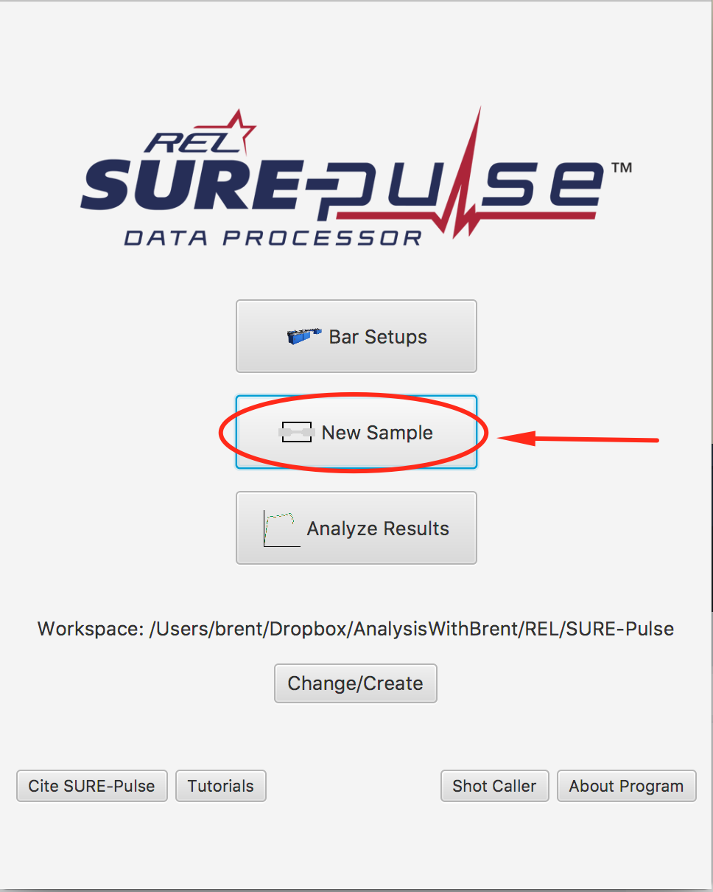

Use the data in `data/Sample 014 Parameters.txt` to fill in the compression sample menu.
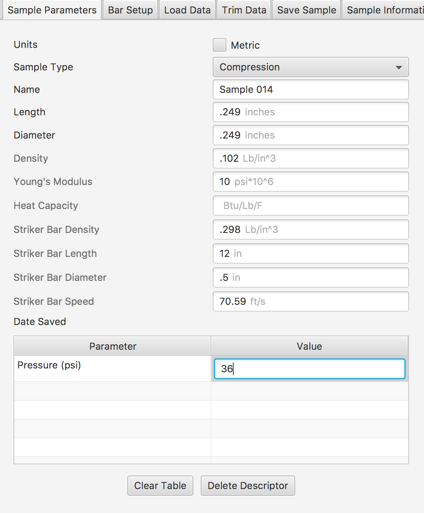

Choose the correct bar setup from the QA.
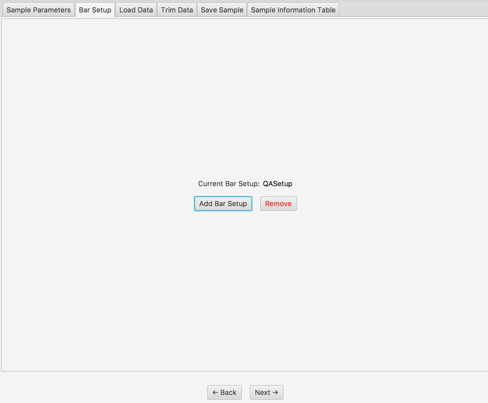

Load and parse the data file `data/20160112-014.txt`. Correctly label the time, incident bar voltage column, and transmission bar voltage column.
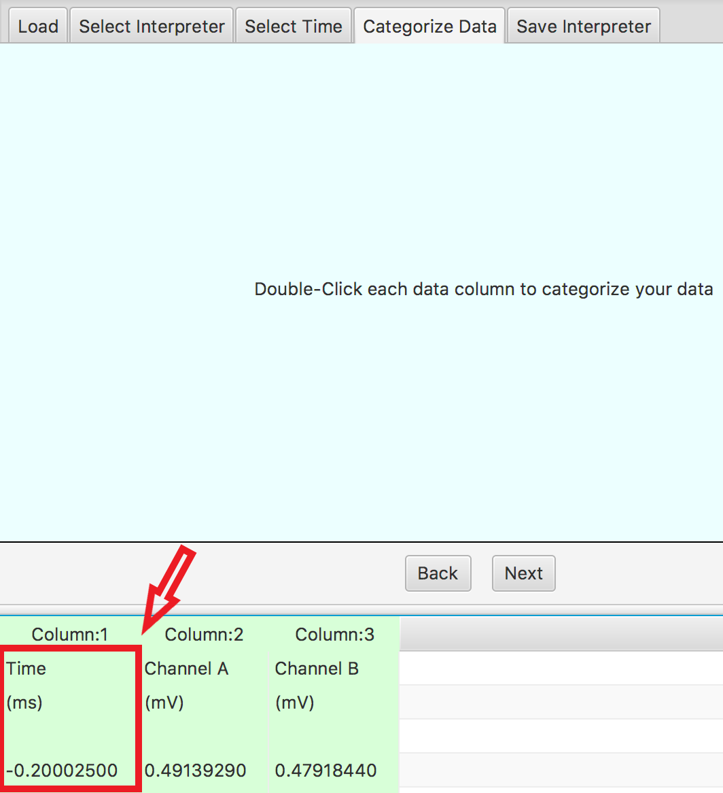

Open trim data and start trimming the Incident bar data. This data needs to be zeroed:

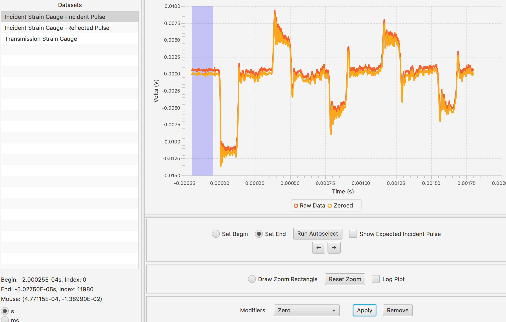

Apply a 600KHz filter and select the incident pulse.

Proceed similarly for the reflected and transmitted pulse.

Save sample into a QA folder.

The expected result should be something like 
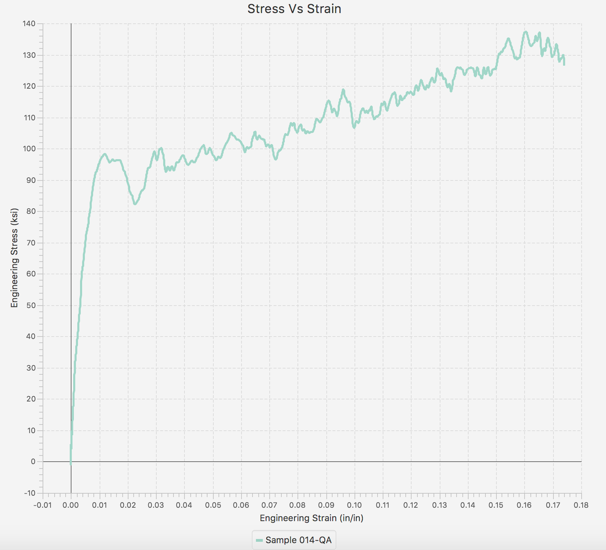

Repeat for Samples 13 and 15 as well. You should get a cluster of three samples.

## Downsampling

One feature of Sure Pulse is the ability to downsample data to improve processing speed.

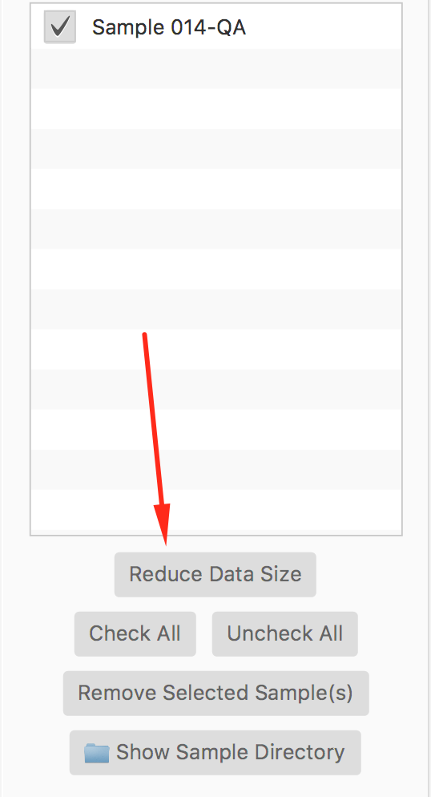

Reduce the data size to 500 samples.

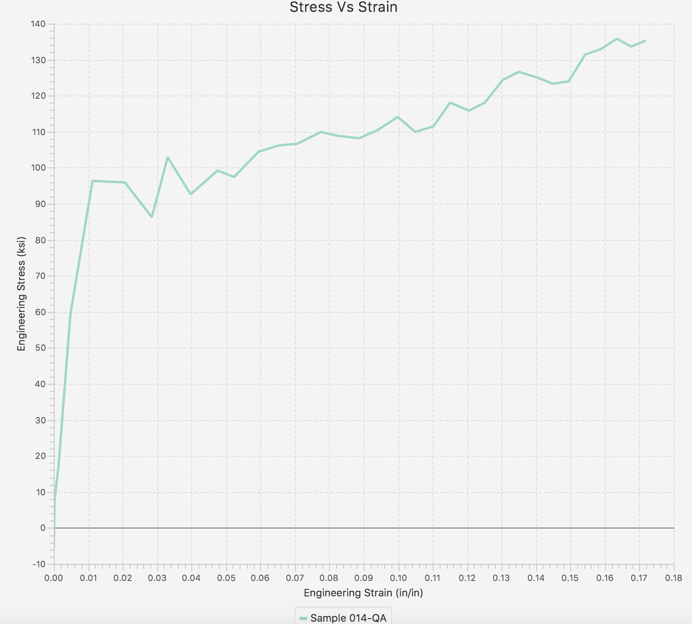

## Global filters
Apply a global filter on load to the sample.

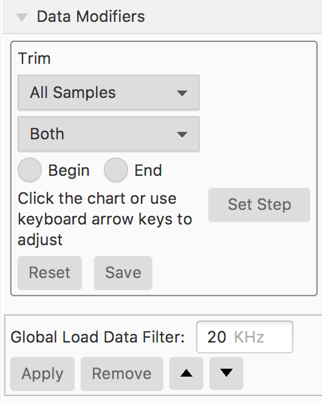

Getting results like.

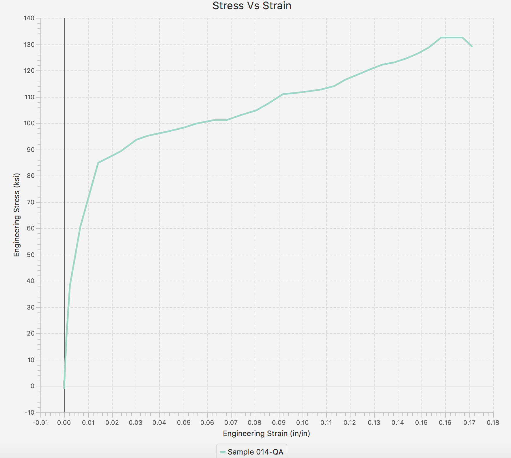

## Trim adjustment

Choose sample 14 in the trim adjustment. Choose stress
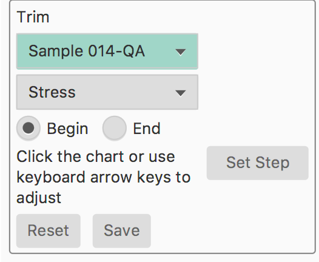

Getting results like.
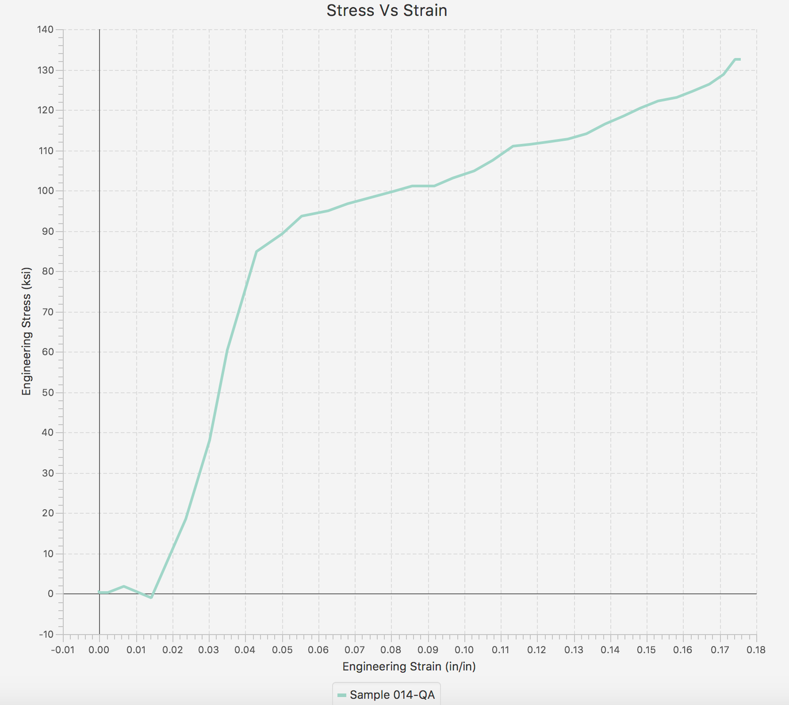
