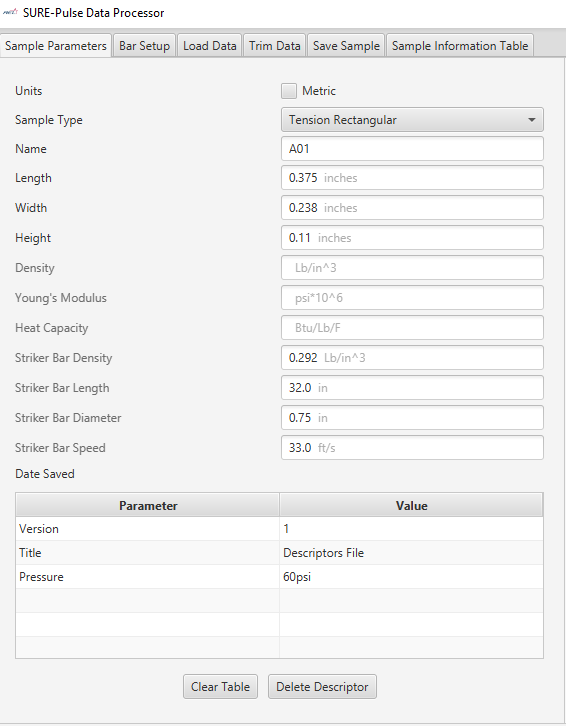
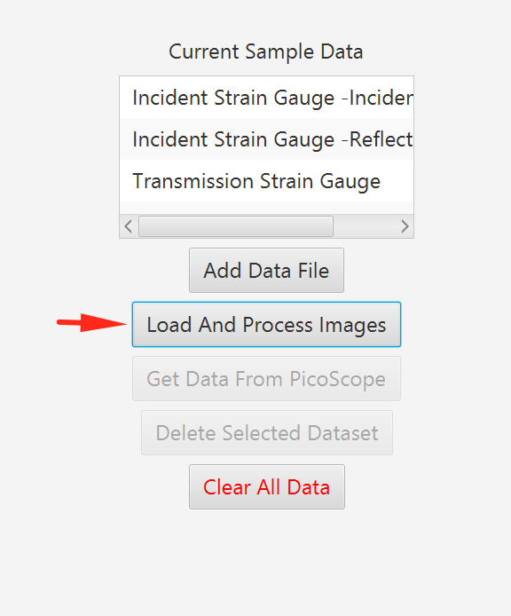
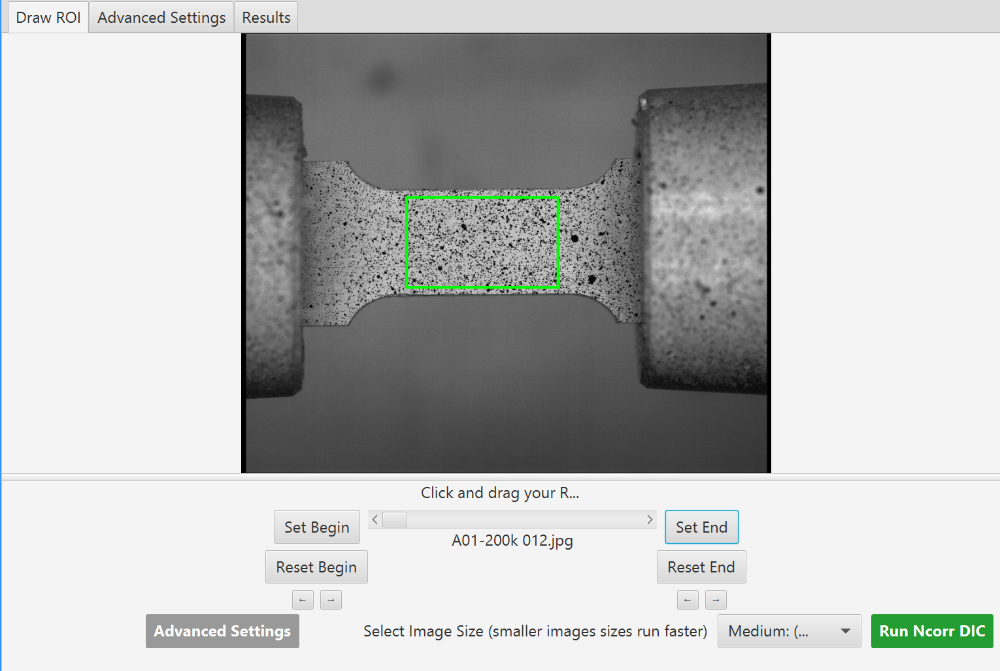
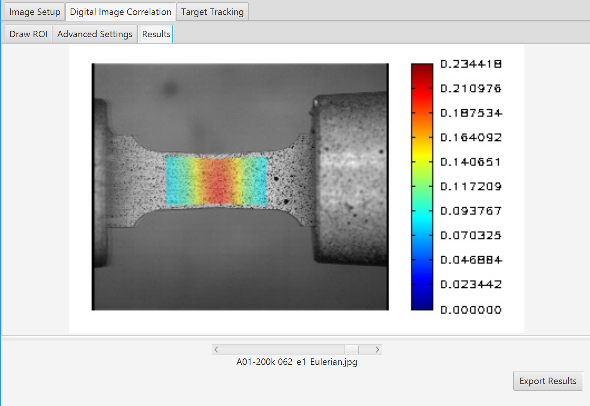
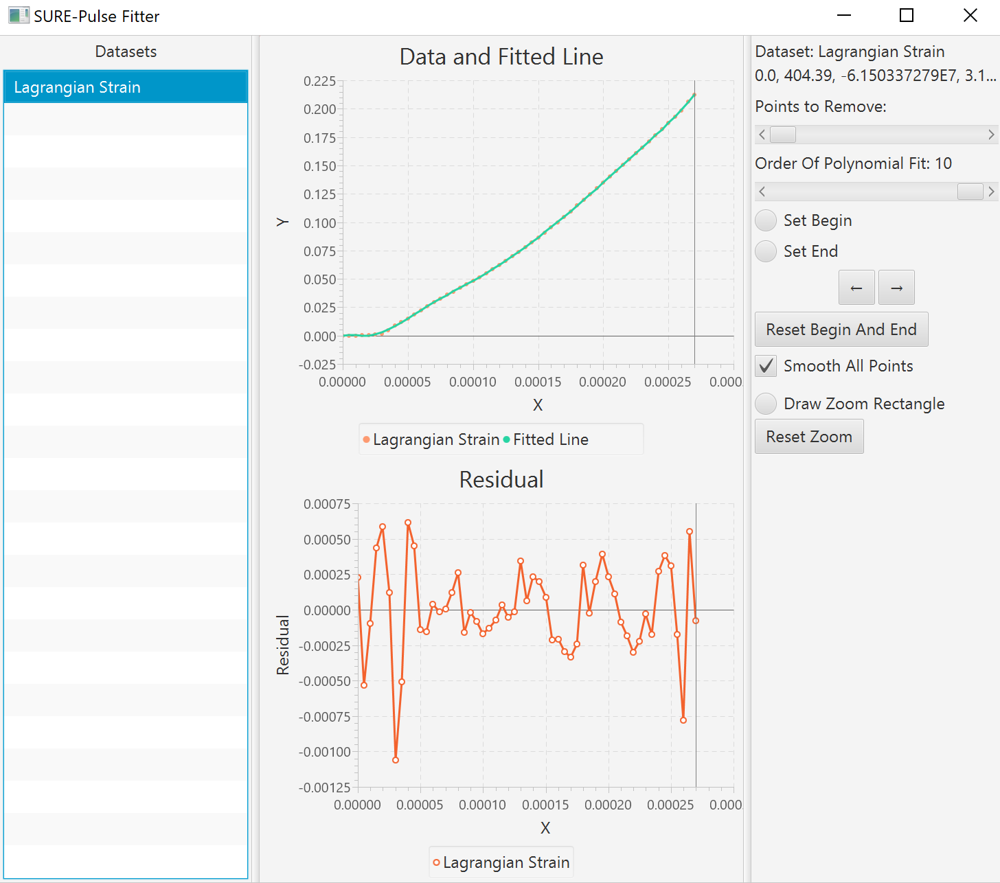
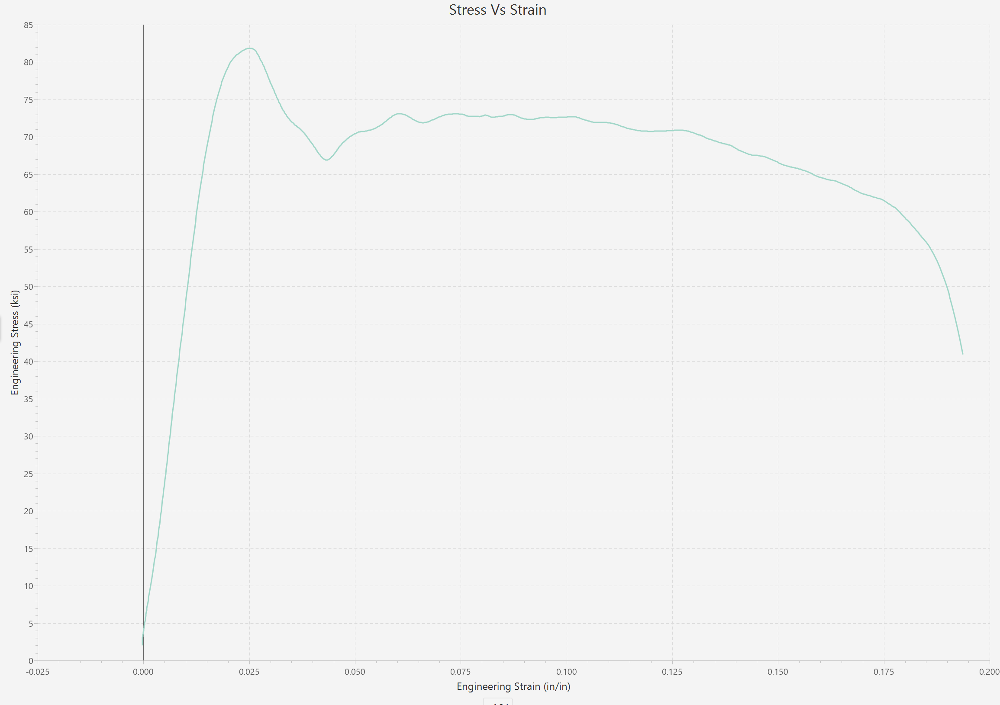

# Tension Rectangular Testing QA 
*Note: requires Windows to run*

Create a new Tension Sample in the new sample creation menu. The sample parameters are as pictured.

Choose the QATensionSetup. bar setup.

## Load data
Load the data in data/A01/20190624-A01-32in-33fps.txt and select the first pulse as the incident bar, and the second pulse as the transmission bar. Use your brain in labelling data.

## DIC

The tension test involves DIC data, this is computationally expensive.
Enter DIC mode here:

Load all images in `data/A01`, and use a frame rate of 200000.

Enter the Digital Image Correlation tab.

Set the begin by choosing the frame just as motion starts and the end by the failure of the material.

Draw the roi central on the sample.

Run the DIC and export results.

## Trim data
Select the indicident, reflected, and transmitted pulses. Zero the transmitted pulse and apply a 50kHz filter to everything.

### Fitter
Load the Lagrangian strain into the `Fitter`. Fit the curve with a 10th order polynomial.

### Resampler
Resample the data to 1000 points. Adjust the starting selection such that it goes through the minimum of strain.
## Results
Your stress strain curve should look like the following.

